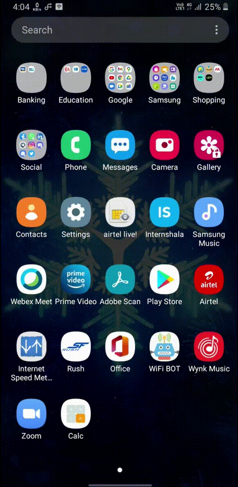

  <br><br>
# Calculator App
Here we are going to see how to make a simple calculator app in kotlin using android studio <br><br>
 ## Creating project
 * Launch android studio<br><br>
  <br><br>
 * Click on `Create New Project`<br><br>
  <br><br>
 * Select `Empty Activity`
 * Click on `Next`<br><br>
  <br><br>
 * Give a Name , Package name 
 * Select Language as `Kotlin`
 * Change Save location if required
 * Select Minimum SDK as required or Select API21(I need  to run app in Android 5.0(lollipop) and above so i choose API21)
 * Click `Finish`<br><br>
  <br><br>
 You can see screen as shown above after build <br><br> 
   <br><br>
 * Open colors.xml by `Android` >> `values` >> `colors.xml` , Double click on colors.xml
 * Make it blank . Copy the code below <br><br>
 ```xml
<?xml version="1.0" encoding="utf-8"?>
<resources>
    <color name="purple_200">#FFBB86FC</color>
    <color name="purple_500">#FF6200EE</color>
    <color name="purple_700">#FF3700B3</color>
    <color name="teal_200">#FF03DAC5</color>
    <color name="teal_700">#FF018786</color>
    <color name="black">#FF000000</color>
    <color name="white">#FFFFFFFF</color>
    <color name="red">#FF3131</color>
    <color name="pink">#FFC0CB</color>
    <color name="orange">#FFA500</color>
    <color name="neon_green">#39FF14</color>
</resources>
```
<br><br>
* Paste it in colors.xml file
* Click on Sync Project with Gradle Files  <br><br>
 <br><br>
* Open themes.xml by `Android` >> `themes` >> `themes.xml` , Double click on themes.xml
* Make it blank . Copy the code below <br><br>
 ```xml
<resources xmlns:tools="http://schemas.android.com/tools">
    <!-- Base application theme. -->
    <style name="Theme.Calc" parent="Theme.MaterialComponents.DayNight.DarkActionBar">
        <!-- Primary brand color. -->
        <item name="colorPrimary">@color/purple_500</item>
        <item name="colorPrimaryVariant">@color/purple_700</item>
        <item name="colorOnPrimary">@color/white</item>
        <!-- Secondary brand color. -->
        <item name="colorSecondary">@color/neon_green</item>
        <item name="colorSecondaryVariant">@color/neon_green</item>
        <item name="colorOnSecondary">@color/black</item>
        <!-- Status bar color. -->
        <item name="android:statusBarColor" tools:targetApi="l">?attr/colorPrimaryVariant</item>
        <!-- Customize your theme here. -->
    </style>
    <style name="splash_screen_theme" parent="Theme.MaterialComponents.Light.NoActionBar">
        <item name="android:windowBackground">@drawable/splash_screen</item>
        <item name="android:statusBarColor">@color/white</item>
    </style>
</resources>
```
<br><br>
* Paste it in themes.xml file
* Click on Sync Project with Gradle Files  <br><br>
<br><br>
* Open splash_screen.xml by `Android` >> `drawable` >> `splash_screen.xml` , Double click on splash_screen.xml
* Make it blank . Copy the code below <br><br>
```xml
<?xml version="1.0" encoding="utf-8"?>
<layer-list xmlns:android="http://schemas.android.com/apk/res/android">
<item android:drawable="@color/white"/>
    <item android:drawable="@drawable/ic_logo" android:gravity="center"/>
</layer-list>
```
<br><br>
* Paste it in splash_screen.xml file
* Click on Sync Project with Gradle Files  <br><br>
<br><br>
* Open styles.xml by `Android` >> `values` >> `styles.xml` , Double click on style.xml
* Make it blank . Copy the code below <br><br>
```xml
<?xml version="1.0" encoding="utf-8"?>
<resources>
    <style name="Button_Style" parent="Widget.AppCompat.Button.Colored">
        <item name="android:background">@color/white</item>
        <item name="android:textSize">24sp</item>
        <item name="android:textColor">@color/black</item>
        <item name="android:gravity">center</item>
    </style>
</resources>
```
<br><br>
* Paste it in themes.xml file
* Click on Sync Project with Gradle Files  <br><br>
<br><br>
* Open activity_main.xml by `Android` >> `layout` >> `activity_main.xml` , Double click on activity_main.xml
* Make it blank . Copy the code below <br><br>
```xml
<?xml version="1.0" encoding="utf-8"?>
<LinearLayout xmlns:android="http://schemas.android.com/apk/res/android"
    xmlns:app="http://schemas.android.com/apk/res-auto"
    xmlns:tools="http://schemas.android.com/tools"
    android:layout_width="match_parent"
    android:layout_height="match_parent"
    android:background="@color/black"
    android:orientation="vertical"
    tools:context=".MainActivity">

    <LinearLayout
        android:layout_width="match_parent"
        android:layout_height="0dp"
        android:layout_weight="1"
        android:background="@color/black"
        android:gravity="bottom"
        android:orientation="vertical"
        android:padding="30dp">

        <TextView
            android:id="@+id/input"
            android:layout_width="match_parent"
            android:layout_height="wrap_content"
            android:gravity="end"
            android:textColor="@color/white"
            android:textSize="30sp"
            tools:text="5+10-3" />

        <TextView
            android:id="@+id/output"
            android:layout_width="match_parent"
            android:layout_height="wrap_content"
            android:gravity="end"
            android:textColor="@color/neon_green"
            android:textSize="50sp"
            tools:text="12" />

    </LinearLayout>

    <TableLayout
        android:layout_width="match_parent"
        android:layout_height="wrap_content"
        android:stretchColumns="*">

        <TableRow>

            <androidx.appcompat.widget.AppCompatButton
                android:id="@+id/button_clear"
                style="@style/Button_Style"
                android:layout_width="wrap_content"
                android:layout_height="90dp"
                android:text="Del"
                android:textColor="@color/red" />

            <androidx.appcompat.widget.AppCompatButton
                android:id="@+id/button_bracket_left"
                style="@style/Button_Style"
                android:layout_width="wrap_content"
                android:layout_height="90dp"
                android:text="("
                android:textColor="@color/orange" />

            <androidx.appcompat.widget.AppCompatButton
                android:id="@+id/button_bracket_right"
                style="@style/Button_Style"
                android:layout_width="wrap_content"
                android:layout_height="90dp"
                android:text=")"
                android:textColor="@color/orange" />

            <androidx.appcompat.widget.AppCompatButton
                android:id="@+id/button_division"
                style="@style/Button_Style"
                android:layout_width="wrap_content"
                android:layout_height="90dp"
                android:text="÷"
                android:textColor="@color/orange" />


        </TableRow>

        <TableRow>

            <androidx.appcompat.widget.AppCompatButton
                android:id="@+id/button_7"
                style="@style/Button_Style"
                android:layout_width="wrap_content"
                android:layout_height="90dp"
                android:text="7" />

            <androidx.appcompat.widget.AppCompatButton
                android:id="@+id/button_8"
                style="@style/Button_Style"
                android:layout_width="wrap_content"
                android:layout_height="90dp"
                android:text="8" />

            <androidx.appcompat.widget.AppCompatButton
                android:id="@+id/button_9"
                style="@style/Button_Style"
                android:layout_width="wrap_content"
                android:layout_height="90dp"
                android:text="9" />

            <androidx.appcompat.widget.AppCompatButton
                android:id="@+id/button_multiply"
                style="@style/Button_Style"
                android:layout_width="wrap_content"
                android:layout_height="90dp"
                android:text="×"
                android:textColor="@color/orange" />

        </TableRow>

        <TableRow>

            <androidx.appcompat.widget.AppCompatButton
                android:id="@+id/button_4"
                style="@style/Button_Style"
                android:layout_width="wrap_content"
                android:layout_height="90dp"
                android:text="4" />

            <androidx.appcompat.widget.AppCompatButton
                android:id="@+id/button_5"
                style="@style/Button_Style"
                android:layout_width="wrap_content"
                android:layout_height="90dp"
                android:text="5" />

            <androidx.appcompat.widget.AppCompatButton
                android:id="@+id/button_6"
                style="@style/Button_Style"
                android:layout_width="wrap_content"
                android:layout_height="90dp"
                android:text="6" />

            <androidx.appcompat.widget.AppCompatButton
                android:id="@+id/button_subtraction"
                style="@style/Button_Style"
                android:layout_width="wrap_content"
                android:layout_height="90dp"
                android:text="—"
                android:textColor="@color/orange" />


        </TableRow>

        <TableRow>

            <androidx.appcompat.widget.AppCompatButton
                android:id="@+id/button_1"
                style="@style/Button_Style"
                android:layout_width="wrap_content"
                android:layout_height="90dp"
                android:text="1" />

            <androidx.appcompat.widget.AppCompatButton
                android:id="@+id/button_2"
                style="@style/Button_Style"
                android:layout_width="wrap_content"
                android:layout_height="90dp"
                android:text="2" />

            <androidx.appcompat.widget.AppCompatButton
                android:id="@+id/button_3"
                style="@style/Button_Style"
                android:layout_width="wrap_content"
                android:layout_height="90dp"
                android:text="3" />

            <androidx.appcompat.widget.AppCompatButton
                android:id="@+id/button_addition"
                style="@style/Button_Style"
                android:layout_width="wrap_content"
                android:layout_height="90dp"
                android:text="+"
                android:textColor="@color/orange" />

        </TableRow>

        <TableRow>

            <androidx.appcompat.widget.AppCompatButton
                android:id="@+id/button_percent"
                style="@style/Button_Style"
                android:layout_width="wrap_content"
                android:layout_height="90dp"
                android:text="%" />

            <androidx.appcompat.widget.AppCompatButton
                android:id="@+id/button_0"
                style="@style/Button_Style"
                android:layout_width="wrap_content"
                android:layout_height="90dp"
                android:text="0" />

            <androidx.appcompat.widget.AppCompatButton
                android:id="@+id/button_dot"
                style="@style/Button_Style"
                android:layout_width="wrap_content"
                android:layout_height="90dp"
                android:text="." />

            <androidx.appcompat.widget.AppCompatButton
                android:id="@+id/button_equals"
                style="@style/Button_Style"
                android:layout_width="wrap_content"
                android:layout_height="90dp"
                android:background="@color/orange"
                android:text="="
                android:textColor="@color/white" />


        </TableRow>
    </TableLayout>
</LinearLayout>
```
<br><br>
* Paste it in activity_main.xml file
* Click on Sync Project with Gradle Files  <br><br>
<br><br>
* Open activity_main.xml by `Android` >> `java` >> `com.pscretn.calc` >> `MainActivity.kt` , Double click on MainActivity.kt
* Make it blank , excluding package com......(in my case `package com.pscretn.calc`) . Copy the code below <br><br>
```kotlin
package com.pscretn.calc
import androidx.appcompat.app.AppCompatActivity
import android.os.Bundle
import androidx.core.content.ContextCompat
import kotlinx.android.synthetic.main.activity_main.*
import org.mariuszgromada.math.mxparser.Expression
import java.text.DecimalFormat

class MainActivity : AppCompatActivity() {
    override fun onCreate(savedInstanceState: Bundle?) {
        super.onCreate(savedInstanceState)
        setTheme(R.style.Theme_Calc)
        setContentView(R.layout.activity_main)

        button_clear.setOnClickListener {
            input.text = ""
            output.text = ""
        }

        button_bracket_left.setOnClickListener {
            input.text = addToInputText("(")
        }
        button_bracket_right.setOnClickListener {
            input.text = addToInputText(")")
        }
        button_0.setOnClickListener {
            input.text = addToInputText("0")
        }
        button_1.setOnClickListener {
            input.text = addToInputText("1")
        }
        button_2.setOnClickListener {
            input.text = addToInputText("2")
        }
        button_3.setOnClickListener {
            input.text = addToInputText("3")
        }
        button_4.setOnClickListener {
            input.text = addToInputText("4")
        }
        button_5.setOnClickListener {
            input.text = addToInputText("5")
        }
        button_6.setOnClickListener {
            input.text = addToInputText("6")
        }
        button_7.setOnClickListener {
            input.text = addToInputText("7")
        }
        button_8.setOnClickListener {
            input.text = addToInputText("8")
        }
        button_9.setOnClickListener {
            input.text = addToInputText("9")
        }
        button_dot.setOnClickListener {
            input.text = addToInputText(".")
        }
        button_division.setOnClickListener {
            input.text = addToInputText("÷") // ALT + 0247
        }
        button_multiply.setOnClickListener {
            input.text = addToInputText("×") // ALT + 0215
        }
        button_subtraction.setOnClickListener {
            input.text = addToInputText("-")
        }
        button_addition.setOnClickListener {
            input.text = addToInputText("+")
        }

        button_equals.setOnClickListener {
            showResult()
        }
        button_percent.setOnClickListener {
            input.text = addToInputText("%")
        }
    }

    private fun addToInputText(buttonValue: String): String {
        return "${input.text}$buttonValue"
    }

    private fun getInputExpression(): String {
        var expression = input.text.replace(Regex("÷"), "/")
        expression = expression.replace(Regex("×"), "*")
        return expression
    }

    private fun showResult() {
        try {
            val expression = getInputExpression()
            val result = Expression(expression).calculate()
            if (result.isNaN()) {
                // Show Error Message
                output.text = "Error"
                output.setTextColor(ContextCompat.getColor(this, R.color.red))
            } else {
                // Show Result
                output.text = DecimalFormat("0.######").format(result).toString()
                output.setTextColor(ContextCompat.getColor(this, R.color.neon_green))
            }
        } catch (e: Exception) {
            // Show Error Message
            output.text = "Error"
            output.setTextColor(ContextCompat.getColor(this, R.color.red))
        }
    }
}
```
* Paste it in Main_Activity.kt file
* Click on Sync Project with Gradle Files  <br><br>
 ## Adding Icon for app
 Now we are going to add a icon for our app for that <br><br>
 <br><br>
 * Select `Android` >> Click on `mipmap`
 * Right click on `mipmap` >> `New` >> Image Asset<br><br>
  <br><br>
 * Change Icon Type: `Launcher Icons(Adaptive and Legacy)
 * Select Foreground Layer
 * Set Asset Type: to `Image`
 * Select Path: of image (You can get icon from images in this repository)
 * Set Trim: to `Yes` and Resize it 
 * Click `Next`<br><br>
 <br><br>
 * Select Background Layer
 * Set Asset Type: to `Color` and Change Value of Color
 * Click `Next`<br><br>
 <br><br>
 * Click `Finish`<br><br>
 ## Setting Splash Screen Logo
 Now we are going  set up a splash screen that will show up while opening application<br><br>
  <br><br>
 * Select `Android` >> Click on `drawable`
 * Right click on `drawable` >> `New` >> `Vector Asset`<br><br>
  <br><br>
 * Set Asset Type: to `Local file(SVG,PSD)`
 * Select Path: of image (You can get logo from images in this repository)
 * Adjust Size and Opacity if required
 * Click `Next`<br><br>
  <br><br>
* Click `Finish`<br><br>
### Test App
Now you can test app on virtual device or your phone <br><br>
 <br><br>
* Click on `Run` >> `Run 'app'`<br>
if any error occured while testing , recheck everything and retest app
### Build Apk
After Successful test we can build our app<br><br>
 <br><br>
* Click on `Build` >> `Build Bundle(s) / APK(s)` >> `Build APK(s)`<br><br>
Now we are done with everything and we have successfully build an android  calculator application in kotlin
